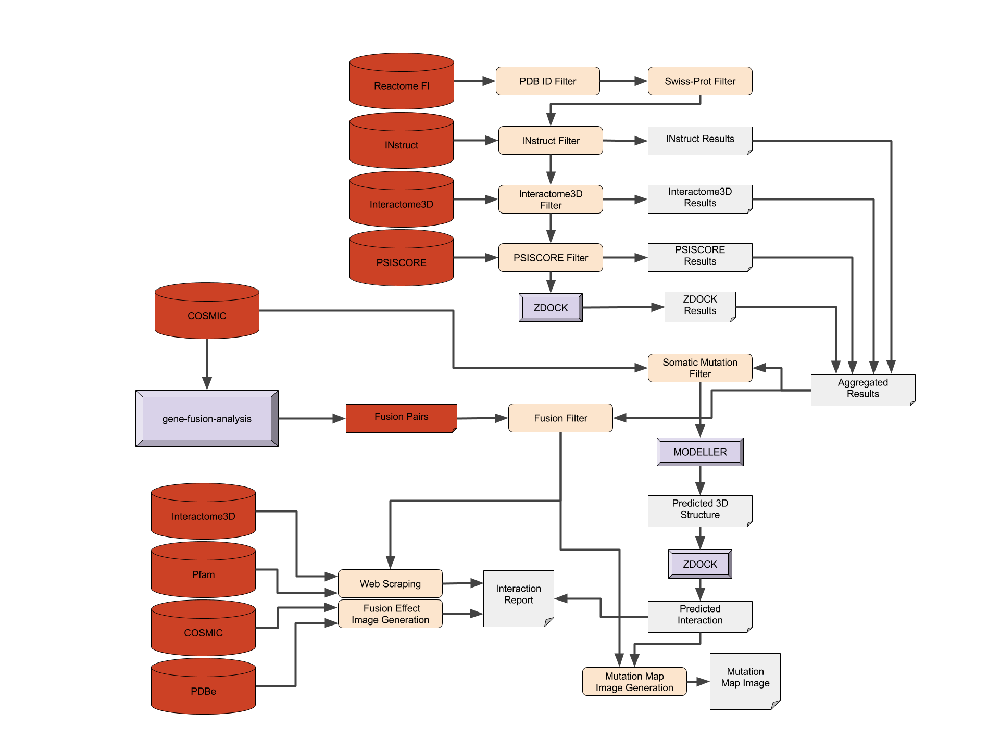
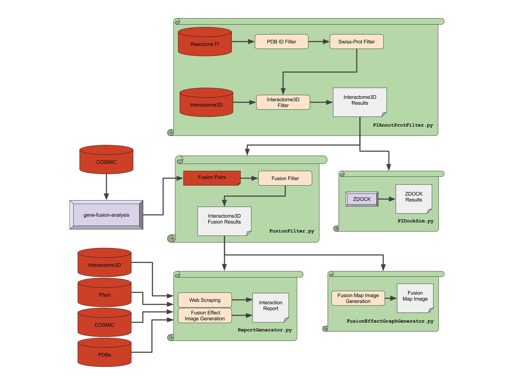

# ReactomePPI

## Proposed Architecture


## Current Architecture


## Input

[ReactomeFI](http://reactomews.oicr.on.ca:8080/caBigR3WebApp2014/FIsInGene_121514_with_annotations.txt.zip)

Format
```
Gene1    Gene2    Annotation    Direction    Score
A2M    APOA1    inhibit    -|    1.00
A2M    APP    predicted    -    0.61
A2M    BMP1    inhibit    -|    1.00
A2M    CDC42    catalyze    ->    1.00
A2M    CTSB    predicted    -    0.61
```

(200,000+ rows)

## Preprocessing

### MyGene

[Reference](https://pypi.python.org/pypi/mygene)

### Install

```bash
$ pip install mygene
```

### Usage

```python
import mygene
mg = mygene.MyGeneInfo()
geneSymbols = ['ZNF888', 'ZP1', 'ZP2']
mg.querymany(geneSymbols,
             scopes="symbol",
             fields=["pdb","uniprot"],
             species="human",
             as_dataframe=True)
```

## Preprocessing

Python script produces 72000+ rows.  
72123 / 217250 = 0.33198
33% coverage of FI's

Many genes have several PDB's, so calculating the best-docking complex will require testing all possible pairs. We'll need to reduce our dataset in order to perform docking simulations as each simulation takes between 15 minutes and an hour. We'll use Eric Leung's [gene-fusion-analysis work](https://github.com/erictleung/gene-fusion-analysis) (forked [here](https://github.com/joshuaburkhart/gene-fusion-analysis)) to filter the gene pairs to only those including genes involved in a fusion event.

```
Example:

Fusion Event from Eric's Work
{Gene A <connected to> Gene B}

Included in Docking Simulation
Gene Pair {A, X}
Gene Pair {A, Y}
Gene Pair {D, A}
Gene Pair {B, Z}
Gene Pair {C, B}

Not Included in Docking Simulation
Gene Pair {C, D}
Gene Pair {X, Y}
```

## PPI

### Query Interactome3D Database for Known Interactions & Complexes

[API](http://interactome3d.irbbarcelona.org/help.php#restful)  
[Data](http://interactome3d.irbbarcelona.org/help.php#interactions_dat_file)

### Use a Modelling Program to Assess Putative Interactions & Complexes

####ZDOCK

Example:  

```
mark_sur receptor.pdb receptor_m.pdb  
mark_sur ligand.pdb ligand_m.pdb  
zdock -R receptor_m.pdb -L ligand_m.pdb -o zdock.out  
create.pl zdock.out  
```

Please note: The file uniCHARMM should be in the current directory when
executing mark_sur. Also, receptor_m.pdb, ligand_m.pdb and create_lig must
be in your current directory when you create all predicted structures
using create.pl.

Standard PDB format files must be processed by mark_sur before being used as
the input to ZDOCK. Formatted PDB files of docking benchmark can be downloaded
at http://zlab.umassmed.edu/benchmark. If you know that some atoms
are not in the binding site, you can block them by changing their ACE type
(column 55-56) to 19. This blocking procedure can improve docking
performance significantly. A blocking script block.pl is included, type
"block.pl" for usage information.

Execution Issues:

You may have to increase the stack size with ```$ ulimit -s 16384``` to avoid mark_sur segmentation faults. See [the Hex manual](http://bioweb.cbm.uam.es/courses/Farmamol07/dia5/hex_manual.pdf) (Appendix E) for details.

Install Issues:

The mark_sur executable requires libg2c0, which depends on gcc-3.4-base.

- [Add the below lines to /etc/apt/sources.list](http://askubuntu.com/questions/39628/old-version-of-gcc-for-new-ubuntu)

```
deb     http://snapshot.debian.org/archive/debian/20070730T000000Z/ lenny main
deb-src http://snapshot.debian.org/archive/debian/20070730T000000Z/ lenny main
deb     http://snapshot.debian.org/archive/debian-security/20070730T000000Z/ lenny/updates main
deb-src http://snapshot.debian.org/archive/debian-security/20070730T000000Z/ lenny/updates main
```

- Install dependencies and libg2c0

```
$ sudo apt-get update
$ sudo apt-get install build-essential
$ sudo apt-get install gcc-3.4-base
$ sudo apt-get install libg2c0
```

Install Notes:

- You may have to sprinkle ```$ sudo apt-get -f install``` into the above solution to fix broken packages.
- You can download the libg2c0 deb package with ```curl "old-releases.ubuntu.com/ubuntu/pool/universe/g/gcc-3.4/libg2c0_3.4.6-6ubuntu5_amd64.deb" -o libg2c0_3.4.6-6ubuntu5_amd64.deb``` and install it with ```sudo dpkg -i libg2c0_3.4.6-6ubuntu5_amd64.deb```.

### Interpretation

Complexes are reported by ZDOCK as .pdb's and can be visualized with software such as [JMol](http://jmol.sourceforge.net/).


